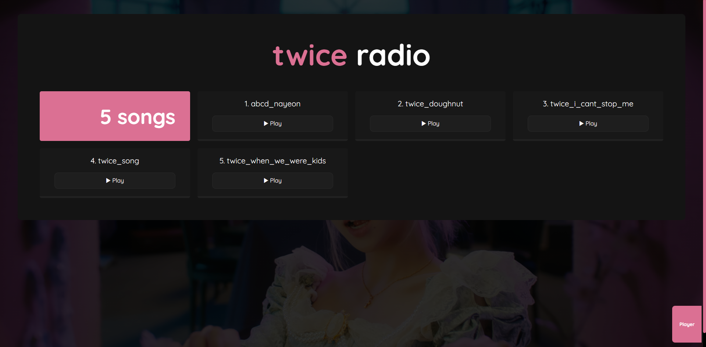
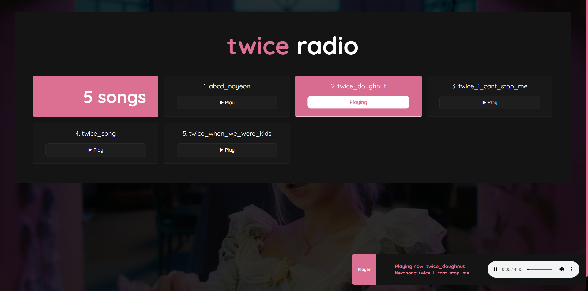

# 🍙 tw-radio

Your music in your local environment, to listen to wherever you want

## 🍥 Features

- Easily configurable environment ⚒.
- You can customize the client without headaches 🧉.
- Available on desktop and mobile 🪂.
- Fast charging with chunks 🌠.
- Integration with Docker 🐳.

## 🌊 Preview




## 🥗 Installation and usage

1. Clone this repository: `https://github.com/alenj0x1/tw-radio.git`.
2. Creates an `.env` file based on the `.env.example` file and your preferences. Example:

```
SERVER_PORT=3000 # Your preference port
MUSIC_DIRECTORY=./home/music # Music in your file system
PUBLIC_DIRECTORY=/etc/radio/public # For easy client modifications
```

3. Install docker. If you don't have it installed yet, you can download it from [here](https://docs.docker.com/get-started/get-docker/).
4. Use `docker compose up` to create and run the container.
5. If everything worked correctly, you should be able to access `http://localhost:<PORT>` locally.
6. Enjoy

## 🥡 Customization

- **Adding new music**: Add your new music to the directory you defined in the `MUSIC_DIRECTORY` variable in your `.env` file.
- **Define your own styles**: Modify the files in the folder you defined in the `PUBLIC_DIRECTORY` variable in your `.env` file. Example: `/etc/radio/public/styles/index.css`.
- **Set your background**: Change the `background.jpg` file in the `/public/assets` folder to the one of your choice. By default it is set to `.jpg` type, you can change this in `/public/styles/index.css` file.

Made listening to [fromis_9](https://open.spotify.com/intl-es/artist/24nUVBIlCGi4twz4nYxJum)
